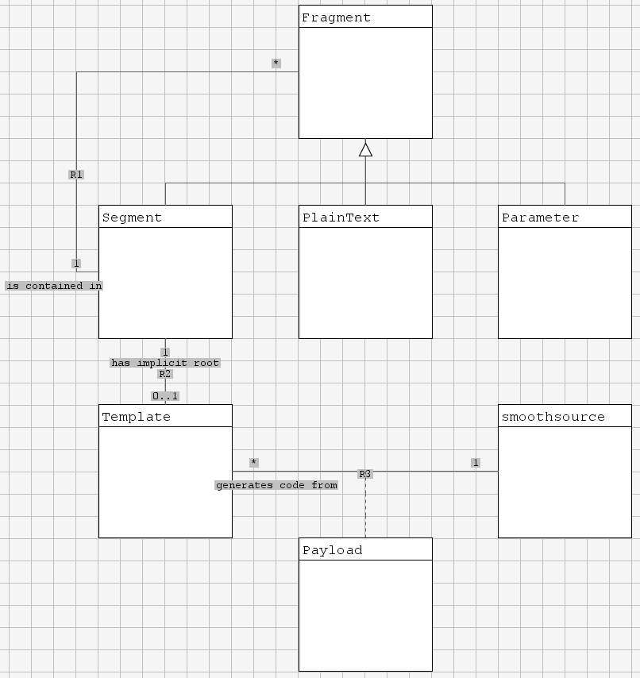
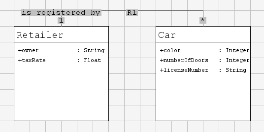

# smoothsource
Template-based code generation engine in python 3.
The smoothsource engine decomposes a template file into fragments. A fragment can be either plain text, a parameter, or a segment. A segment is either an array segment or a condition segment. Segments contains fragments, i.e. plain text, parameters or other segments. The template file itself is an implicit segment (root segment).

<style type="text/css">
    img {
        image-rendering: pixelated;
        border: 4px solid powderblue;
    }
</style>


A class diagram showing smoothsource classes.
## Payload
During generation of a template every fragment is populated with payload data. The payload is given by the user as input to the generation.
``` python
# Example payload
payload={
"parameterName0": "data123",
"parameterName1": "321atad",
"arrayName": [
    {
        "elementData": "1st"
    },
    {
        "elementData": "2nd"
    },
    {
        "elementData": "3rd"
    },
],
"conditionName": 1 == 2
}
```
## Parameter
A parameter fragment is a placeholder for payload data. The smoothsource engine will substitute parameters by their corresponding value in the payload.

The syntax for marking a parameter fragment is:
```
{{parameterName}}
```

Transformations can be applied on parameters during generation.
* upperCC, class - Transform the first letter to upper case
* lowerCC, variable - Transform the first letter to lower case
* datetime - Insert current date and time. TODO: Add @format@ as option.

Syntax:
```
{{parameterName:upperCC}}
```

## Array
When generating an array segment the smoothsource engine iterates over an array provided in the payload and for each iteration populate the fragments with corresponding element data. 

The syntax for marking an array segment is:
```
[[arrayName|This is a plain text fragment, elementData={{elementData}}]]
```

Transformations can be applied on segments during generation.
* begin@TEXT@ - Inserts TEXT at the beginning of the segment
* end@TEXT@ - Inserts TEXT at the end of the segment

Example payload input:
```python
payload={
"attributes": [
    {
        "attributeType": "Integer",
        "attributeName": "posX"
    },
    {
        "attributeType": "Integer",
        "attributeName": "posY"
    }
]
}
```
Example template syntax:
```
[[attributes:begin@
    // Getters@|
    public {{attributeType}} get{{attributeName:class}}()
    {
        return _{{attributeName}};
    }]]
```

## Condition
Much like array segments, condition semgents contains fragments. The condition segment is only populated during generation if the corresponding expression evaluates ```True``` in the payload data. If an array is given in the payload data the condition segment will be populated if the array is non-empty.

Example payload input:
```python
payload={
    "condition0": True,
    "condition1": variable % 2 == 0,
    "attributes": [ ... ]
}
```
Example template syntax:
```
<?condition0|This will be generated?>
<?condition1|Here is another text block.?>
<?attributes|Attribute array contains element data.?>
```
## Scope
When populating the fragments with payload data the fragment is looked up in the current scope first. If there is no data for the fragment in the current scope the smoothsource engine will continue to search the outer scopes for payload data.
```python
payload={
    "paramScope0": "123",
    "arrayScope0": [
        {
            "paramScope1": "456"
        },
        {
            "paramScope1": "789"
        }
    ]
}
```
Example retrieving data from outer scope:
```
class {{paramScope0}}:
    [[arrayScope0|A scope 1 parameter: {{paramScope1}}
    A scope 0 parameter: {{paramScope0}}]]
```
## Syntax highlighting
A syntax highlighting extension for VS Code is can be cloned from https://github.com/filipfur/smoothsource-highlighting.git. To install the extension, copy the extension directory to <user home>/.vscode/extensions and restart VS Code. Smoothsource template files with file extension .smoothsource will now be syntax highlighted.

## Examples
This repository includes some example projects for demonstration and testing purposes.
### Shopping list
A shopping list generated from a .smoothsource template.
```bash
# Generate shopping list by running
python src/shoppinglist.py
```

### Model to java generation
A simple java test application.



A class diagram of the example domain 'cars'.
```bash
# Generate java source code from example model
python src/modeltojava.py

# Compile java test program
cd test/xtuml/src
javac Main.java

# Run java test program
java Main
```
